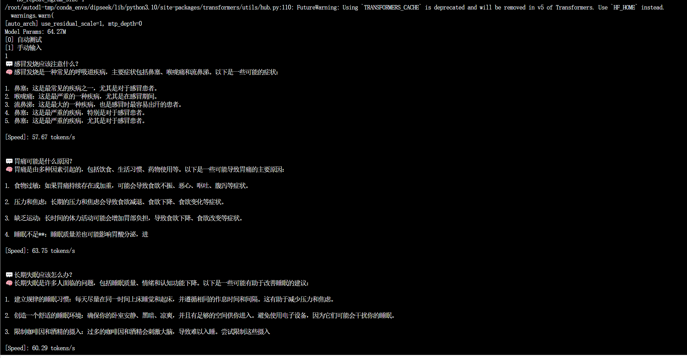
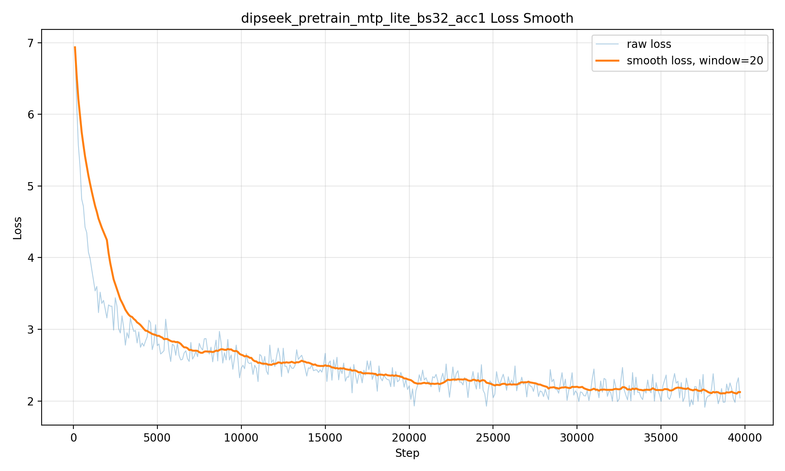
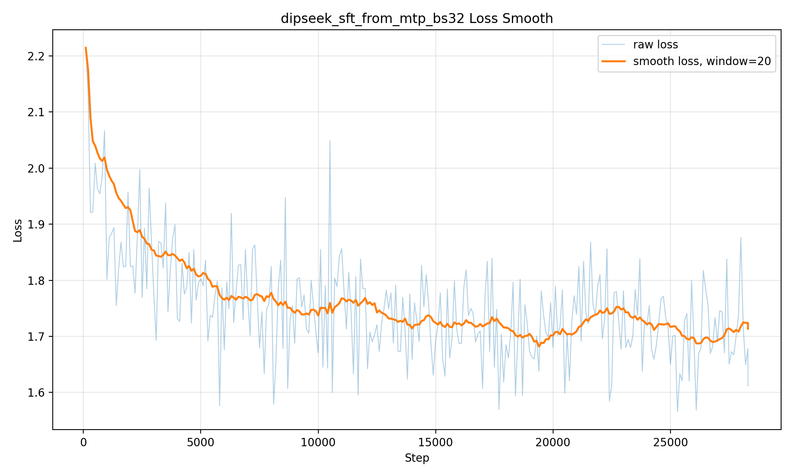
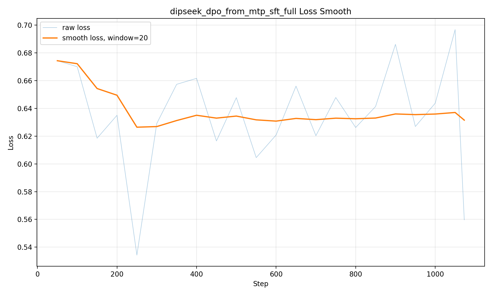
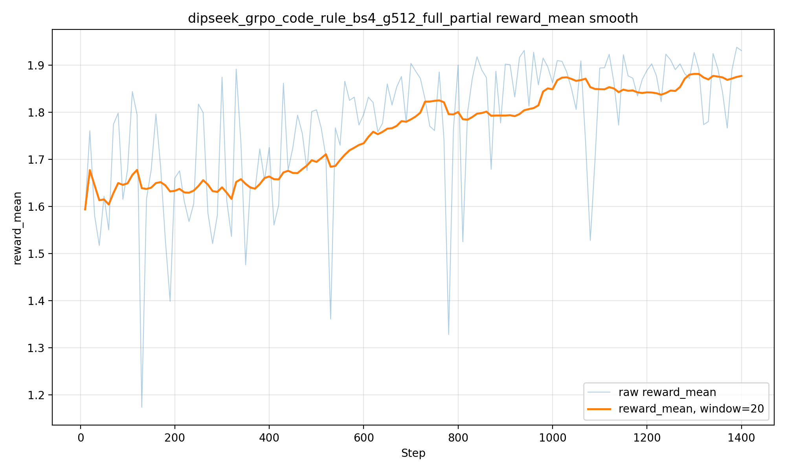
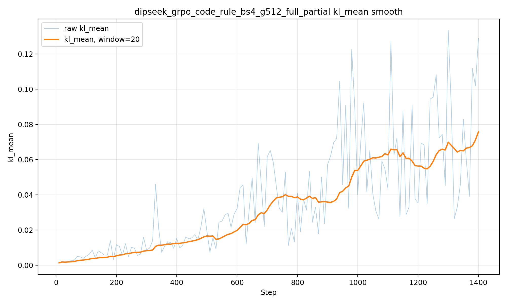
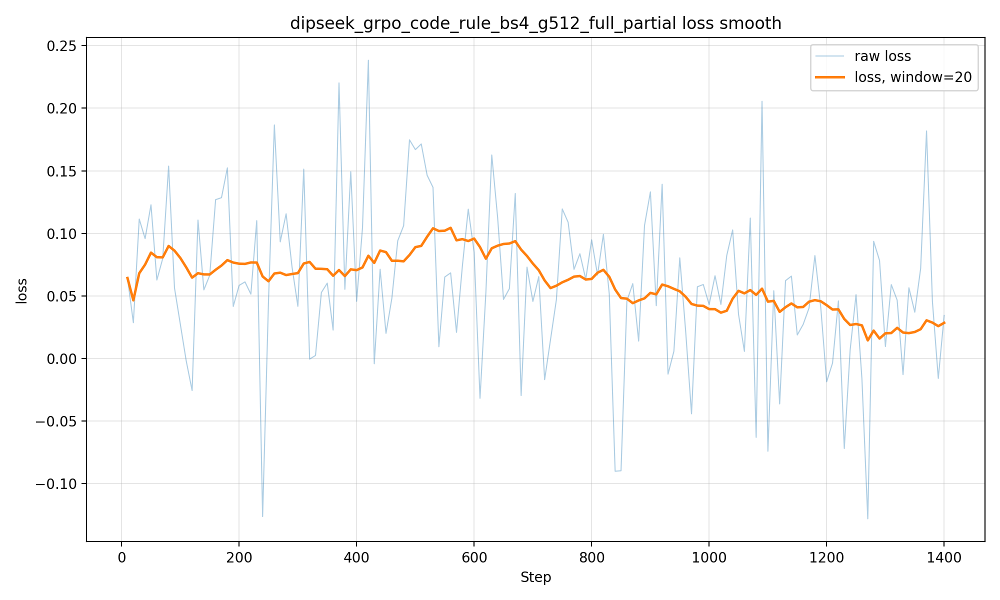
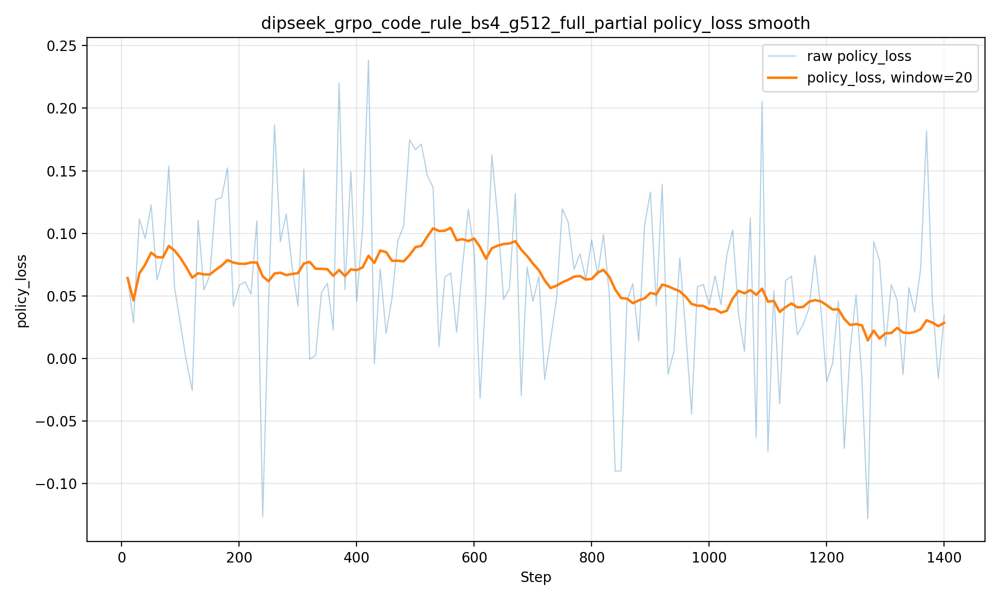

# DipSeek

<p align="center">
  <b>从 MiniMind 出发，复现一条小而完整的 LLM 训练链路。</b><br/>
  <b>Pretrain → SFT → LoRA → DPO → GRPO，一边训练，一边理解。</b>
</p>

<p align="center">
  <a href="https://github.com/CHEN2003-CHIP/DipSeek"></a>
  
  
  
  
</p>

> **DipSeek** 是一个教学向小语言模型项目，基于 MiniMind 的极简训练思想继续改造，目标不是堆大模型参数，而是用普通开发者也能复现的规模，把 LLM 的关键训练流程真正跑通、看懂、改动、对比和复盘。

本项目适合：

- 想从 0 理解 LLM 训练流程的同学；
- 想学习 Pretrain、SFT、LoRA、DPO、GRPO 的工程实现；
- 想把小模型训练项目写进简历、用于实习面试展示；
- 想基于 MiniMind 做自己的模型结构实验。

<p align="center">
  
</p>

---

## ✨ 项目亮点

### 1. 64M 小模型，完整训练链路

DipSeek 当前主线实验围绕约 **64M 参数中文小模型**展开，覆盖：

```text
Tokenizer / Dataset
→ Pretrain
→ SFT
→ LoRA
→ DPO
→ GRPO
→ Eval / Log / Plot
```

相比只调用大模型 API，本项目更关注：

- 模型结构怎么写；
- loss 怎么算；
- checkpoint 怎么保存；
- LoRA 怎么挂载和保存；
- DPO / GRPO 的训练信号从哪里来；
- 实验失败后怎么定位问题。

### 2. 借鉴 DeepSeek 思路的轻量结构实验

本项目在 MiniMind 风格的小模型基础上加入了若干结构改造：

| 模块 | 作用 | 当前状态 |
|---|---|---|
| `MTP-lite` | 轻量多 token 预测辅助目标 | 已加入 Pretrain 实验 |
| `Residual Scale` | 给 attention / MLP 残差分支加入可学习缩放 | 已加入模型结构 |
| `LoRA alpha / target` | 支持可配置 LoRA rank、alpha、target modules | 已加入训练脚本 |
| `eval LoRA config` | 推理时支持 LoRA rank / alpha / target 对齐 | 建议提交正式修复 |
| `GRPO rule reward` | 基于规则奖励的 GRPO 小规模实验 | 已有 partial 日志和曲线 |

> 注意：DipSeek 是个人教学项目，与 DeepSeek 官方无关。

### 3. 不只跑成功，也记录失败实验

本项目保留了多个实验结论，尤其是 LoRA：

- `fulltarget + rank16`：训练 loss 更低，但生成严重退化，出现词汇坍缩；
- `attention rank8`：比 fulltarget 稳定，但没有稳定超过 SFT 基座；
- `q/v rank4 + lr1e-5`：LoRA 更轻，但仍然出现模板化和重复；
- 当前结论：对 64M 小模型来说，LoRA 更适合轻量风格迁移，不适合直接提升高风险医学专业问答。

这类失败记录比只展示成功结果更有学习价值，也更适合面试讲解。

---

## 📊 实验曲线

> 以下图片来自当前实验日志，可放在仓库 `assets/` 目录中。

### Pretrain / SFT

<p align="center">
  
  
</p>

### DPO

<p align="center">
  
</p>

### GRPO Partial

<p align="center">
  
  
</p>

<p align="center">
  
  
</p>

---

## 🧱 项目结构

```text
DipSeek/
├── dataset/                  # 数据集与数据读取逻辑
├── docs/                     # 环境配置、训练记录、实验说明
├── model/
│   ├── model_dipseek.py      # DipSeek 模型结构
│   └── model_lora.py         # LoRA 挂载、保存、加载逻辑
├── scripts/                  # 日志分析、画图、辅助脚本
├── trainer/
│   ├── train_pretrain.py     # 预训练
│   ├── train_sft.py          # 监督微调
│   ├── train_lora.py         # LoRA 微调
│   ├── train_dpo.py          # DPO 训练
│   └── train_grpo.py         # GRPO 训练
├── eval_llm.py               # 命令行推理测试
├── requirements.txt
└── README.md
```

---

## 🚀 快速开始

### 1. 克隆项目

```bash
git clone https://github.com/CHEN2003-CHIP/DipSeek.git
cd DipSeek
```

### 2. 创建环境

推荐 Python 3.10：

```bash
conda create -n dipseek python=3.10 -y
conda activate dipseek
```

安装依赖：

```bash
pip install -r requirements.txt
```

如果你在 AutoDL 上使用已有 CUDA / PyTorch 环境，建议先检查：

```bash
python - <<'PY'
import torch
print('torch:', torch.__version__)
print('cuda available:', torch.cuda.is_available())
print('cuda:', torch.version.cuda)
print('gpu:', torch.cuda.get_device_name(0) if torch.cuda.is_available() else 'CPU')
PY
```

---

## 📦 数据准备

本项目实验主要使用 MiniMind 数据集。Hugging Face 直连较慢时，可以使用 ModelScope 镜像。

### Hugging Face 下载

```bash
pip install -U huggingface_hub hf_xet

hf download jingyaogong/minimind_dataset \
  lora_medical.jsonl \
  --repo-type dataset \
  --local-dir ./dataset
```

### ModelScope 下载

```bash
pip install -U modelscope

modelscope download \
  --dataset gongjy/minimind_dataset \
  lora_medical.jsonl \
  --local_dir ./dataset
```

检查数据：

```bash
ls -lh dataset/lora_medical.jsonl
head -n 1 dataset/lora_medical.jsonl
```

---

## 🏋️ 训练流程

下面的命令以 AutoDL 路径为例，按需替换数据和权重名称。

### 1. Pretrain

```bash
cd trainer

python -u train_pretrain.py \
  --data_path ../dataset/pretrain_t2t_mini.jsonl \
  --save_weight dipseek_pretrain_mtp_lite_bs32_acc1 \
  --epochs 1 \
  --batch_size 32 \
  --accumulation_steps 1 \
  --max_seq_len 512 \
  --hidden_size 768 \
  --num_hidden_layers 8 \
  --use_residual_scale 1 \
  --mtp_depth 1 \
  --mtp_loss_weight 0.2 \
  --dtype float16 \
  > ../runs/logs/dipseek_pretrain_mtp_lite_bs32_acc1.log 2>&1
```

### 2. SFT

```bash
cd trainer

python -u train_sft.py \
  --data_path ../dataset/sft_t2t_mini.jsonl \
  --from_weight dipseek_pretrain_mtp_lite_bs32_acc1 \
  --save_weight dipseek_sft_from_mtp_bs32 \
  --epochs 1 \
  --batch_size 32 \
  --accumulation_steps 1 \
  --max_seq_len 512 \
  --hidden_size 768 \
  --num_hidden_layers 8 \
  --use_residual_scale 1 \
  --mtp_depth 0 \
  --mtp_loss_weight 0.0 \
  --dtype float16 \
  > ../runs/logs/dipseek_sft_from_mtp_bs32.log 2>&1
```

### 3. LoRA

LoRA 训练时一定要保证：

```text
训练时的 lora_rank / lora_alpha / lora_target
必须和推理时完全一致。
```

示例：

```bash
cd trainer

python -u train_lora.py \
  --data_path ../dataset/lora_medical.jsonl \
  --from_weight dipseek_sft_from_mtp_bs32 \
  --lora_name dipseek_lora_medical_attn_r8_res1_bs32 \
  --epochs 1 \
  --batch_size 32 \
  --accumulation_steps 1 \
  --max_seq_len 512 \
  --hidden_size 768 \
  --num_hidden_layers 8 \
  --use_residual_scale 1 \
  --residual_scale_init 1.0 \
  --mtp_depth 0 \
  --mtp_loss_weight 0.0 \
  --dtype float16 \
  --learning_rate 5e-5 \
  --lora_rank 8 \
  --lora_alpha 16 \
  --lora_target q_proj,k_proj,v_proj,o_proj \
  > ../runs/logs/dipseek_lora_medical_attn_r8_res1_bs32.log 2>&1
```

### 4. DPO

```bash
cd trainer

python -u train_dpo.py \
  --data_path ../dataset/dpo.jsonl \
  --from_weight dipseek_sft_from_mtp_bs32 \
  --save_weight dipseek_dpo_from_mtp_sft_full \
  --hidden_size 768 \
  --num_hidden_layers 8 \
  --use_residual_scale 1 \
  --dtype float16 \
  > ../runs/logs/dipseek_dpo_from_mtp_sft_full.log 2>&1
```

### 5. GRPO

GRPO 比 SFT / LoRA 慢，因为它需要先生成多个回答，再根据 reward 计算相对优势。建议先跑 smoke：

```bash
cd trainer

python -u train_grpo.py \
  --from_weight dipseek_sft_from_mtp_bs32 \
  --save_weight dipseek_grpo_code_rule_bs4_g512_full \
  --hidden_size 768 \
  --num_hidden_layers 8 \
  --use_residual_scale 1 \
  --batch_size 4 \
  --max_new_tokens 512 \
  --dtype float16 \
  > ../runs/logs/dipseek_grpo_code_rule_bs4_g512_full.log 2>&1
```

如果只是验证流程，建议先把生成长度降到 128 或 256。

---

## 💬 推理测试

### SFT 基座

```bash
python eval_llm.py \
  --load_from model \
  --save_dir out \
  --weight dipseek_sft_from_mtp_bs32 \
  --hidden_size 768 \
  --num_hidden_layers 8 \
  --max_new_tokens 160 \
  --temperature 0.25 \
  --top_p 0.75 \
  --repetition_penalty 1.18 \
  --no_repeat_ngram_size 4
```

### SFT + LoRA

```bash
python eval_llm.py \
  --load_from model \
  --save_dir out \
  --weight dipseek_sft_from_mtp_bs32 \
  --lora_weight dipseek_lora_medical_attn_r8_res1_bs32 \
  --hidden_size 768 \
  --num_hidden_layers 8 \
  --lora_rank 8 \
  --lora_alpha 16 \
  --lora_target q_proj,k_proj,v_proj,o_proj \
  --max_new_tokens 160 \
  --temperature 0.25 \
  --top_p 0.75 \
  --repetition_penalty 1.18 \
  --no_repeat_ngram_size 4
```

---

## 🔬 当前实验结论

### LoRA 结论

| 实验 | 配置 | 观察 | 结论 |
|---|---|---|---|
| `fulltarget_bs32` | rank=16, alpha=32, attention+MLP 全 target | loss 更低，但生成出现词汇坍缩 | 不推荐 |
| `attn_r8_res1_bs32` | rank=8, alpha=16, q/k/v/o | 可正常生成，但仍有重复和模板化 | 可作为跑通版 |
| `qv_r4_res1_lr1e5_bs32` | rank=4, alpha=8, q/v | 更轻但没有明显改善 | 不优于 SFT |

阶段性判断：

```text
当前 Medical LoRA 已经跑通，但没有稳定超过 SFT 基座。
对 64M 小模型来说，LoRA 更适合身份、风格、格式迁移；
如果目标是医学事实准确性，应优先提升 SFT 数据和评估集质量，而不是继续加大 LoRA。
```

### GRPO 结论

当前 GRPO 更适合作为教学型复现：

- 学习 rule reward 设计；
- 理解 group-relative advantage；
- 记录 reward、KL、policy loss、response length；
- 做 SFT / DPO / GRPO 对比。

不建议一开始追求大规模长时间复现。对找实习来说，更有价值的是：

```text
小规模跑通 + 曲线分析 + 失败案例复盘 + 面试能讲清楚。
```

---

## 🧠 适合写进简历的描述

> 在个人 LLM 项目 DipSeek 中，从零构建 64M 参数中文小模型训练链路，完成 Pretrain、SFT、LoRA、DPO/GRPO 后训练实验；实现轻量 MTP-lite、Residual Scale、LoRA alpha/target 配置化，并修复训练-推理 LoRA 配置不一致问题。针对 GRPO，实现基于规则奖励的代码/格式任务训练流程，记录 reward、KL、loss、response length 等指标，并完成与 SFT/LoRA 的对比分析。

---

## 🧩 已知问题

- 当前模型规模较小，知识准确性有限；
- Medical LoRA 会带来一定重复和模板化，不建议作为默认能力展示；
- GRPO 长序列训练成本较高，建议先使用小规模 smoke；
- `eval_llm.py` 需要确保 LoRA rank / alpha / target 与训练配置一致；
- 如果使用 `Residual Scale` 训练，LoRA / DPO / GRPO 阶段也需要保持架构参数一致。

---

## 🗺️ Roadmap

- [x] MiniMind 风格模型重命名与项目独立化
- [x] 64M Pretrain / SFT 训练链路
- [x] MTP-lite 轻量多 token 预测实验
- [x] Residual Scale 结构实验
- [x] LoRA alpha / target 配置化
- [x] DPO 训练曲线记录
- [x] GRPO rule reward partial 实验
- [ ] 自动化 eval benchmark
- [ ] 更干净的 LoRA 数据清洗脚本
- [ ] 训练日志一键画图脚本整理
- [ ] README 英文版
- [ ] 面试版技术报告

---

## 🙏 Acknowledgements

本项目受到以下开源项目和论文/报告启发：

- [MiniMind](https://github.com/jingyaogong/minimind)：极简小模型全流程训练项目；
- [DeepSeek-V3](https://github.com/deepseek-ai/DeepSeek-V3)：MTP、工程化训练思路启发；
- [DeepSeek-R1](https://arxiv.org/abs/2501.12948)：RL 后训练与推理能力激励思路；
- Hugging Face Transformers / TRL：训练与评估生态参考。

---

## 📄 License

本项目用于学习、实验和教学展示。请根据你实际采用的上游项目许可证补充本仓库 License。

